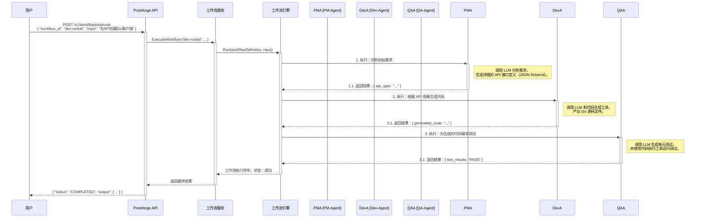

# Protoforge 架构设计文档

## 1. 概述

本文档详细阐述了 `protoforge` 项目的系统架构、设计原则和技术决策。`protoforge` 是一个面向企业级应用、使用 Golang 构建的多智能体（Multi-Agent）AI 应用开发框架。其设计目标是提供一个高性能、可扩展、安全且易于使用的平台，赋能中小企业（SME）和独立软件供应商（ISV）快速构建、部署和管理复杂的 AI 工作流。

本文档旨在为项目开发者、贡献者和最终用户提供一个清晰的技术蓝图，确保所有参与方对系统的设计有统一的理解。

### 1.1. DFX 全景分析 (Design for X)

我们的设计哲学围绕一系列“为X而设计”（DFX）的原则，以确保系统在整个生命周期中的健壮性和可维护性。

* **为开发者体验而设计 (Design for Developer Experience - DX)**
    * **全景**：开发者是框架的核心用户。我们必须提供清晰的 API、详尽的文档、直观的工具和快速的反馈循环。目标是降低构建复杂 AI 应用的门槛，同时为高级用户保留足够的灵活性。
    * **解决方案**：
        1.  **API 优先**：提供 gRPC 和 RESTful 两种形式的统一 API，定义清晰，文档完善（例如，通过 Protobuf 和 OpenAPI/Swagger）。
        2.  **插件化架构**：开发者可以通过实现简单的 Go 接口，轻松集成自定义的工具、模型和数据源。
        3.  **可视化支持**：后端 API 专门为驱动一个类似 Flowise/LangFlow 的可视化工作流编辑器而设计，支持节点的拖拽、连接和配置。
        4.  **Go 原生**：对于 Go 开发者，提供符合其语言习惯的 SDK，避免了跨语言集成的复杂性。
    * **预期效果**：开发者能够快速上手，无论是通过编写代码还是使用可视化界面，都能高效地完成从原型到生产的开发。

* **为可扩展性与性能而设计 (Design for Scalability & Performance)**
    * **全景**：AI 应用，特别是多智能体系统，可能涉及大量的并发计算和 I/O 操作。系统必须能够水平扩展以应对不断增长的负载。
    * **解决方案**：
        1.  **无状态核心服务**：核心的 `protoforge` 服务被设计为无状态的，所有持久化状态（如工作流状态、记忆）都存储在外部数据库（如 PostgreSQL, Redis）中。
        2.  **并发模型**：充分利用 Golang 的 Goroutine 和 Channel，实现高效的并发执行，例如，工作流中的并行节点可以同时运行。
        3.  **容器化部署**：提供官方的 Docker 镜像和 Kubernetes Helm Chart，简化在云原生环境中的部署和弹性伸缩。
        4.  **异步通信**：通过消息队列（如 NATS, RabbitMQ）实现智能体之间的异步通信和任务分发，进一步解耦和提升吞吐量。
    * **预期效果**：系统能够通过增加服务实例来线性扩展，支持从单个节点到大规模集群的部署，满足高并发请求。

* **为安全与合规而设计 (Design for Security & Compliance)**
    * **全景**：面向企业用户的产品，数据安全、访问控制和合规性是首要考虑因素。特别是在处理专有代码、敏感数据时，必须提供强大的安全保障。
    * **解决方案**：
        1.  **私有化部署优先**：架构设计确保所有组件都可以在客户的私有网络（On-Premise）或虚拟私有云（VPC）中部署，无需访问公网。
        2.  **多租户架构**：在数据层面通过 `tenant_id` 实现数据隔离。API 层通过身份验证（如 JWT）和基于角色的访问控制（RBAC）来保护资源。
        3.  **全面的审计日志**：对所有关键操作（API 调用、工作流执行、模型调用、工具使用）进行详细的日志记录，以供审计和追踪。
        4.  **知识产权保护机制**：为代码生成场景，规划了许可证扫描工具集成、生成内容溯源（水印）等功能。
    * **预期效果**：企业可以放心地将 `protoforge` 用于其核心业务，满足严格的数据安全和行业合规要求。

## 2. 系统架构

`protoforge` 采用经典的分层架构，将系统划分为四个主要层次：展现层、应用层、领域层和基础设施层。这种架构模式实现了关注点分离，使得系统各部分可以独立开发、测试和演进。

### 2.1. 总体架构图

以下图表展示了 `protoforge` 的核心组件及其相互关系。

```mermaid
graph TD
    subgraph 用户端 [用户端（Clients）]
        direction LR
        CLI[命令行工具（CLI）]
        WebApp[可视化编辑器/Web应用（Visual Editor/Web App）]
        SDK[外部应用/SDK（External Apps/SDKs）]
    end

    subgraph Protoforge核心服务 [Protoforge 核心服务（Core Service）]
        direction TB
        subgraph P[展现层（Presentation Layer）]
            API_GW[API网关（API Gateway）] --> GRPCS[gRPC 服务]
            API_GW --> RESTS[REST API 服务]
            API_GW --> WSS[WebSocket 服务]
        end

        subgraph A[应用层（Application Layer）]
            WorkflowSvc[工作流服务（Workflow Service）]
            AgentSvc[智能体服务（Agent Service）]
            ToolSvc[工具服务（Tool Service）]
        end

        subgraph D[领域层（Domain Layer）]
            Engine[工作流引擎（Workflow Engine）]
            CoreEntities[核心实体与接口<br/>Agent, Tool, Memory, Workflow, Message]
        end

        subgraph I[基础设施层（Infrastructure Layer）]
            Adapters[适配器/插件（Adapters/Plugins）]
            subgraph LLM[LLM 客户端]
                OpenAI[OpenAI Adapter]
                Azure[Azure Adapter]
                LocalLLM[Local LLM Adapter]
            end
            subgraph VS[向量存储]
                Weaviate[Weaviate Adapter]
                PGVector[PGVector Adapter]
            end
            subgraph DB[持久化存储]
                Postgres[PostgreSQL]
                Redis[Redis]
            end
            subgraph Log[可观测性]
                 Logger[日志记录器（Logger）]
                 Metrics[指标（Metrics）]
                 Tracer[追踪（Tracer）]
            end
        end
    end

    %% 交互流
    CLI --> API_GW
    WebApp --> API_GW
    SDK --> API_GW

    P --> A

    A --> D

    A --> I
    D --> I

    %% 依赖关系
    classDef layer fill:#f9f9f9,stroke:#333,stroke-width:2px;
    class P,A,D,I layer;
````

**图解说明**:

  * **用户端（Clients）**: 代表与 `protoforge` 交互的各种方式。`CLI` 用于开发者和管理员进行快速操作。`可视化编辑器` 是低代码开发的主要入口。`外部应用/SDKs` 允许将 `protoforge` 的能力集成到其他业务系统中。
  * **展现层（Presentation Layer）**: 系统的门户，负责处理所有入站请求。它通过 `API 网关` 统一管理 `gRPC`（高性能内部通信）、`REST API`（通用 Web 访问）和 `WebSocket`（实时状态更新）三种协议。
  * **应用层（Application Layer）**: 实现具体的业务用例。例如，`工作流服务` 负责接收执行工作流的请求，并调用领域层的引擎来完成任务。
  * **领域层（Domain Layer）**: 系统的核心，不依赖任何具体技术实现。`核心实体与接口` 定义了智能体、工具、记忆等基本概念。`工作流引擎` 是实现多智能体编排的核心逻辑所在，它解释工作流定义并驱动其执行。
  * **基础设施层（Infrastructure Layer）**：提供所有外部依赖的具体实现。`适配器/插件` 模式使得替换或增加新的 `LLM`、`向量存储` 或 `数据库` 变得简单，只需实现领域层定义的接口即可。

### 2.2. 部署架构图

下图展示了一个典型的 `protoforge` 在云原生环境（如 Kubernetes）中的部署模型。

```mermaid
graph TD
    subgraph Internet [互联网（Internet）]
        User[用户（User）]
    end

    subgraph CloudVPC [云平台VPC / 本地数据中心（Cloud VPC / On-Premise DC）]
        Ingress[入口控制器（Ingress Controller）]

        subgraph K8S [Kubernetes 集群]
            direction LR

            subgraph PF_Core [核心服务 Pods（Core Service Pods）]
                PF1[Protoforge 实例 1]
                PF2[Protoforge 实例 2]
                PF3[...]
            end

            subgraph Frontend [前端 Pods]
                WebApp[可视化编辑器 UI]
            end

            subgraph Dependencies [依赖服务（Managed or Self-hosted）]
                Postgres[PostgreSQL<br/>（工作流定义、状态、审计日志）]
                Redis[Redis<br/>（会话记忆、缓存）]
                VectorDB[向量数据库<br/>（知识库嵌入）]
                Otel[可观测性套件<br/>（Prometheus, Grafana, Jaeger）]
            end

        end

        User --> Ingress
        Ingress --> WebApp
        Ingress --> PF_Core

        PF_Core --> Postgres
        PF_Core --> Redis
        PF_Core --> VectorDB
        PF_Core --> Otel
        WebApp --> PF_Core
    end
```

**图解说明**:

  * 系统被设计为可水平扩展的服务。在 Kubernetes 中，`protoforge` 核心服务可以作为一组无状态的 Pods 运行，并通过 `Ingress Controller` 对外暴露服务。
  * `可视化编辑器 UI` 是一个独立的前端应用，通过 API 与后端核心服务通信。
  * 所有有状态的数据，如工作流定义、会话记忆、向量嵌入等，都由专门的后端服务（`PostgreSQL`, `Redis`, `向量数据库`）管理。这种分离确保了核心服务的可扩展性和可靠性。
  * `可观测性套件` 收集所有组件的日志、指标和追踪数据，为系统运维提供统一的监控视图。

### 2.3. 核心交互流程：产品研发 Agent 工作流

为了更具体地说明系统如何工作，我们以“产品研发三级火箭 Agent”的一个简化场景为例，展示其时序图。

**场景**: 用户提交一个需求：“为我们的 API 创建一个 Go 语言的客户端”。

**参与的智能体**:

  * `PM-Agent` (产品经理 Agent): 澄清需求，定义 API 规格。
  * `Dev-Agent` (开发 Agent): 根据规格编写代码。
  * `QA-Agent` (测试 Agent): 生成测试用例并验证代码。

<!-- end list -->



**图解说明**:

1.  用户通过 API 触发一个预定义的工作流。
2.  `工作流服务` 接收请求，并启动 `工作流引擎`。
3.  `工作流引擎` 按照图中定义的顺序（PM -\> Dev -\> QA）逐个调度智能体节点。
4.  每个智能体执行其特定任务（分析、编码、测试），并将输出传递给图中的下一个节点。
5.  整个过程是自动化的，引擎负责管理状态、数据传递和错误处理。

## 3\. 项目目录结构

项目将遵循标准的 Golang 项目布局，以保持清晰和可维护性。

```
protoforge/
├── api/
│   └── proto/
│       └── v1/
│           ├── agent.proto
│           ├── common.proto
│           ├── tool.proto
│           └── workflow.proto
├── cmd/
│   └── protoforge/
│       └── main.go
├── configs/
│   └── config.yaml.example
├── docs/
│   ├── architecture.md
│   └── assets/
│       ├── architecture_en.png
│       └── architecture_zh.png
├── internal/
│   ├── application/
│   │   ├── services/
│   │   │   ├── agent_service.go
│   │   │   ├── agent_service_test.go
│   │   │   ├── tool_service.go
│   │   │   └── workflow_service.go
│   │   └── services.go
│   ├── common/
│   │   ├── config/
│   │   │   └── config.go
│   │   ├── constants/
│   │   │   └── constants.go
│   │   ├── errors/
│   │   │   └── errors.go
│   │   ├── logging/
│   │   │   └── logger.go
│   │   └── types/
│   │       ├── dto.go
│   │       └── enum.go
│   ├── domain/
│   │   ├── agent/
│   │   │   ├── agent.go
│   │   │   └── message.go
│   │   ├── memory/
│   │   │   └── memory.go
│   │   ├── tool/
│   │   │   └── tool.go
│   │   └── workflow/
│   │       ├── graph.go
│   │       ├── node.go
│   │       └── state.go
│   ├── engine/
│   │   ├── executor.go
│   │   ├── executor_test.go
│   │   └── runner.go
│   ├── infrastructure/
│   │   ├── persistence/
│   │   │   ├── postgres/
│   │   │   │   └── postgres.go
│   │   │   └── redis/
│   │   │       └── redis.go
│   │   ├── providers/
│   │   │   ├── llm/
│   │   │   │   ├── openai.go
│   │   │   │   └── provider.go
│   │   │   └── vectorstore/
│   │   │       ├── provider.go
│   │   │       └── weaviate.go
│   │   └── security/
│   │       └── rbac.go
│   └── transport/
│       ├── grpc/
│       │   ├── server.go
│       │   └── service_impl.go
│       └── rest/
│           ├── handler.go
│           ├── middleware/
│           │   └── auth.go
│           └── server.go
├── pkg/
│   └── sdk/
│       └── client.go
├── scripts/
│   ├── gen_proto.sh
│   └── setup.sh
├── .gitignore
├── go.mod
├── go.sum
├── LICENSE
├── Makefile
├── README.md
└── README-zh.md
```

## 4\. 参考资料

- [1] LangChain Documentation. https://python.langchain.com/docs/get\_started/introduction  
- [2] Microsoft AutoGen. https://microsoft.github.io/autogen/  
- [3] Eino Framework. https://github.com/cloudwego/eino  
- [4] CrewAI Framework. https://github.com/joaomdmoura/crewAI  
- [5] Standard Go Project Layout. https://github.com/golang-standards/project-layout