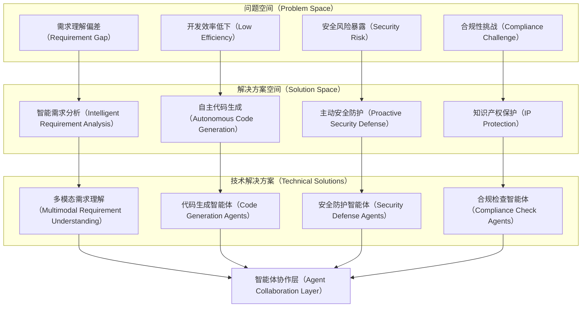
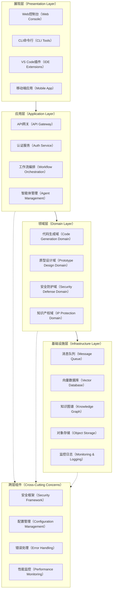
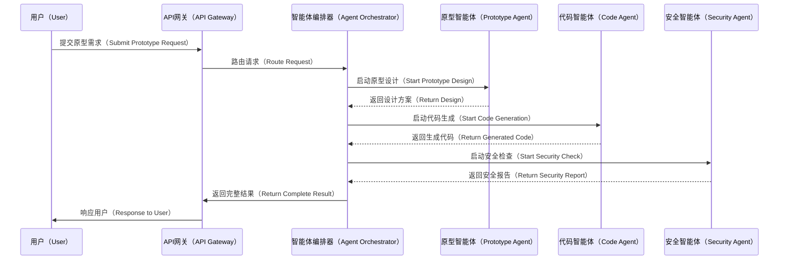
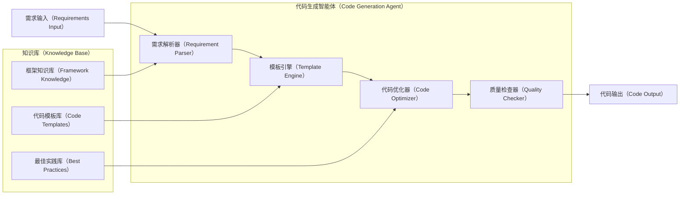
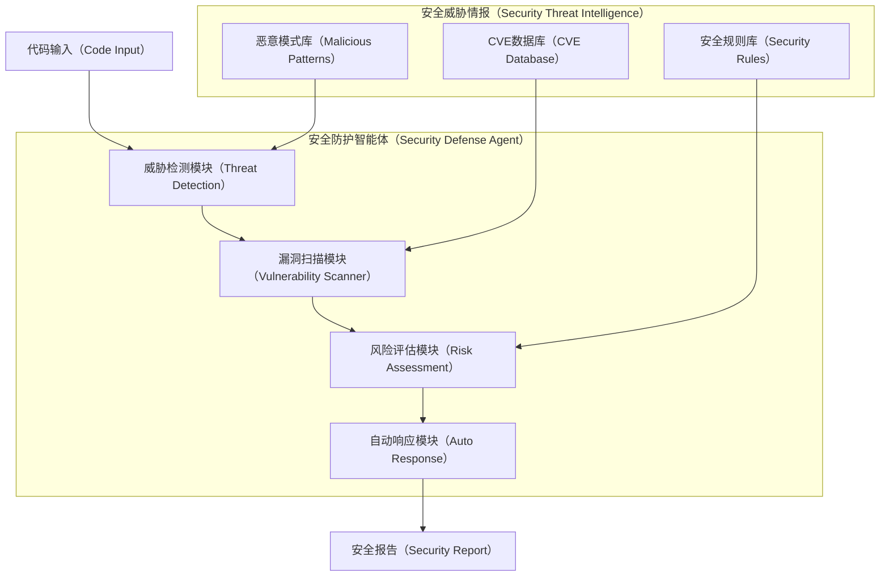
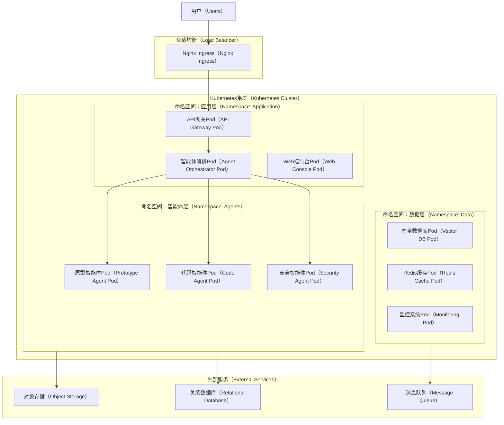

# ProtoForge 架构设计文档

## 1. 概述

ProtoForge 是一个面向企业和独立软件供应商（ISV）的开源AI智能体框架，专注于自主代码生成、产品原型设计、迭代开发和知识产权保护。本文档详细阐述了 ProtoForge 的总体架构设计、核心组件、技术选型以及实现路径。

### 1.1 设计目标

- **企业级安全性**：提供私有化部署能力，确保敏感代码和业务数据的安全
- **可扩展性**：支持水平扩展和微服务架构，适应业务增长需求
- **模块化设计**：基于插件式架构，支持自定义智能体和工具集成
- **多语言支持**：以Go为核心，通过标准化API支持多语言生态系统
- **可观测性**：内置全面的监控、日志和追踪能力

### 1.2 核心价值链

ProtoForge围绕产品研发的"三级火箭"模型构建：

1. **第一级 - 原型设计阶段**：AI辅助需求分析、架构设计和快速原型生成
2. **第二级 - 迭代开发阶段**：自动化代码生成、测试执行和持续集成
3. **第三级 - 知识产权保护**：代码溯源、许可证合规和知识产权管理

## 2. 领域分析与解决方案全景

### 2.1 DFX问题全景

在现代软件开发生命周期中，企业面临以下关键挑战：

| 问题域 | 具体挑战 | 影响程度 | 现有解决方案不足 |
|--------|----------|----------|------------------|
| **设计质量（Design for Quality）** | 需求理解偏差、架构设计不合理 | 高 | 缺乏AI辅助的需求分析和架构优化 |
| **开发效率（Development Efficiency）** | 重复性代码编写、测试覆盖不足 | 高 | 现有代码生成工具缺乏上下文理解 |
| **安全性（Security）** | 代码漏洞、供应链安全风险 | 极高 | 传统安全工具反应式，缺乏预防能力 |
| **可维护性（Maintainability）** | 技术债务累积、文档不同步 | 中 | 缺乏自动化的技术债务检测和修复 |
| **合规性（Compliance）** | 开源许可证风险、知识产权保护 | 高 | 缺乏集成的IP保护和合规检查 |
| **可扩展性（Scalability）** | 架构僵化、扩展困难 | 中 | 缺乏架构演进的智能化指导 |

### 2.2 解决方案全景

ProtoForge通过以下核心能力构建完整的解决方案：



### 2.3 预期效果全景及展望

通过ProtoForge的实施，预期在以下方面产生显著效果：

**短期效果（3-6个月）**：

* 原型开发效率提升60-80%
* 代码质量指标改善（Bug密度降低40%）
* 安全漏洞检出率提升50%

**中期效果（6-12个月）**：

* 端到端开发周期缩短40-50%
* 技术债务减少30%
* IP合规风险降低至近零

**长期愿景（1-3年）**：

* 建立自适应的智能开发生态系统
* 形成行业领先的AI驱动研发方法论
* 构建开源社区驱动的智能体市场

## 3. 系统架构设计

### 3.1 总体架构

ProtoForge采用分层微服务架构，确保系统的可扩展性、可维护性和安全性：



### 3.2 核心组件设计

#### 3.2.1 智能体编排引擎（Agent Orchestration Engine）

智能体编排引擎是ProtoForge的核心组件，负责管理和协调多个智能体的协作：



#### 3.2.2 代码生成智能体（Code Generation Agent）

代码生成智能体负责基于需求和上下文生成高质量代码：



#### 3.2.3 安全防护智能体（Security Defense Agent）

安全防护智能体提供主动的安全威胁检测和响应能力：



### 3.3 部署架构

ProtoForge支持多种部署模式，从单机开发环境到大规模分布式生产环境：



## 4. 技术选型与设计决策

### 4.1 核心技术栈

| 技术领域      | 选择方案        | 版本要求    | 选择理由                   |
| --------- | ----------- | ------- | ---------------------- |
| **核心语言**  | Go          | 1.20.2+ | 高性能、简洁语法、优秀并发支持        |
| **Web框架** | Gin         | v1.9.0+ | 轻量级、高性能、丰富中间件生态        |
| **API协议** | gRPC + REST | -       | gRPC用于内部通信，REST用于外部API |
| **数据库**   | PostgreSQL  | 14.0+   | 强一致性、丰富扩展、JSON支持       |
| **向量数据库** | ChromaDB    | 0.4.0+  | 开源、易部署、Python生态兼容      |
| **消息队列**  | NATS        | 2.9.0+  | 云原生、高性能、简单运维           |
| **缓存**    | Redis       | 7.0+    | 高性能、丰富数据结构             |
| **容器化**   | Docker      | 20.10+  | 标准化部署、环境一致性            |
| **编排**    | Kubernetes  | 1.25+   | 容器编排标准、丰富生态            |

### 4.2 AI模型集成策略

ProtoForge采用模型无关的设计，支持多种AI模型：

```mermaid
graph LR
    %% AI模型集成架构
    subgraph MA[模型适配层（Model Adapter Layer）]
        MA1[OpenAI适配器（OpenAI Adapter）]
        MA2[Azure适配器（Azure Adapter）]
        MA3[开源模型适配器（Open Source Adapter）]
        MA4[本地模型适配器（Local Model Adapter）]
    end

    subgraph MI[模型接口（Model Interface）]
        MI1[文本生成接口（Text Generation）]
        MI2[代码生成接口（Code Generation）]
        MI3[嵌入向量接口（Embedding）]
        MI4[多模态接口（Multimodal）]
    end

    subgraph MM[模型管理（Model Management）]
        MM1[模型路由（Model Router）]
        MM2[负载均衡（Load Balancer）]
        MM3[失败回退（Fallback）]
        MM4[监控统计（Monitoring）]
    end

    AGENTS[智能体层（Agents）] --> MM
    MM --> MI
    MI --> MA
    MA --> MODELS[外部模型（External Models）]
```



## 5. 项目目录结构

rotoForge的目录结构设计如下：

```
protoforge/
├── cmd/                          # 应用程序入口点
│   ├── server/                   # 服务端主程序
│   ├── cli/                      # CLI命令行工具
│   └── migrator/                 # 数据库迁移工具
├── internal/                     # 内部包，不对外暴露
│   ├── common/                   # 通用组件
│   │   ├── config/              # 配置管理
│   │   ├── logger/              # 日志组件
│   │   ├── errors/              # 错误定义
│   │   ├── constants/           # 常量定义
│   │   └── types/               # 通用类型定义
│   ├── core/                    # 核心业务逻辑
│   │   ├── domain/              # 领域模型
│   │   ├── service/             # 业务服务
│   │   ├── repository/          # 数据访问层
│   │   └── usecase/             # 用例层
│   ├── agent/                   # 智能体相关
│   │   ├── orchestrator/        # 智能体编排器
│   │   ├── prototype/           # 原型设计智能体
│   │   ├── codegen/             # 代码生成智能体
│   │   ├── security/            # 安全防护智能体
│   │   └── ip/                  # 知识产权智能体
│   ├── api/                     # API层
│   │
│   ├── api/                     # API层
│   │   ├── http/                # HTTP API处理器
│   │   ├── grpc/                # gRPC服务实现
│   │   └── middleware/          # 中间件
│   ├── infrastructure/          # 基础设施层
│   │   ├── database/            # 数据库连接和操作
│   │   ├── cache/               # 缓存实现
│   │   ├── queue/               # 消息队列
│   │   ├── storage/             # 对象存储
│   │   └── monitoring/          # 监控和追踪
│   └── workflow/                # 工作流引擎
│       ├── engine/              # 工作流执行引擎
│       ├── builder/             # 工作流构建器
│       └── scheduler/           # 任务调度器
├── pkg/                         # 对外公开的库包
│   ├── client/                  # 客户端SDK
│   ├── agent/                   # 智能体接口定义
│   ├── workflow/                # 工作流接口
│   └── types/                   # 公共类型定义
├── api/                         # API定义文件
│   ├── proto/                   # protobuf定义
│   ├── openapi/                 # OpenAPI规范
│   └── graphql/                 # GraphQL定义
├── configs/                     # 配置文件
│   ├── default.yaml             # 默认配置
│   ├── development.yaml         # 开发环境配置
│   └── production.yaml          # 生产环境配置
├── scripts/                     # 构建和部署脚本
│   ├── build/                   # 构建脚本
│   ├── deploy/                  # 部署脚本
│   └── migration/               # 数据库迁移脚本
├── deployments/                 # 部署配置
│   ├── docker/                  # Docker配置
│   ├── kubernetes/              # Kubernetes配置
│   └── helm/                    # Helm Charts
├── docs/                        # 文档
│   ├── architecture.md          # 架构文档
│   ├── api/                     # API文档
│   └── examples/                # 示例代码
├── examples/                    # 使用示例
│   ├── quickstart/              # 快速开始示例
│   ├── rd-workflow/             # 研发工作流示例
│   └── security-defense/        # 安全防护示例
├── test/                        # 测试文件
│   ├── integration/             # 集成测试
│   ├── e2e/                     # 端到端测试
│   └── fixtures/                # 测试数据
├── web/                         # 前端资源
│   ├── ui/                      # Web UI源码
│   └── static/                  # 静态资源
├── tools/                       # 开发工具
│   ├── codegen/                 # 代码生成工具
│   └── linter/                  # 代码检查工具
├── vendor/                      # 依赖包（go mod vendor）
├── .github/                     # GitHub相关配置
│   ├── workflows/               # GitHub Actions
│   └── ISSUE_TEMPLATE/          # Issue模板
├── go.mod                       # Go模块定义
├── go.sum                       # Go模块校验和
├── Makefile                     # 构建脚本
├── Dockerfile                   # Docker镜像构建
├── docker-compose.yml           # 本地开发环境
├── README.md                    # 项目说明（英文）
├── README-zh.md                 # 项目说明（中文）
├── LICENSE                      # 开源许可证
└── CONTRIBUTING.md              # 贡献指南
```