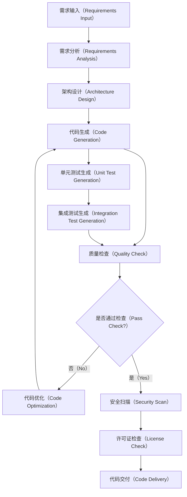
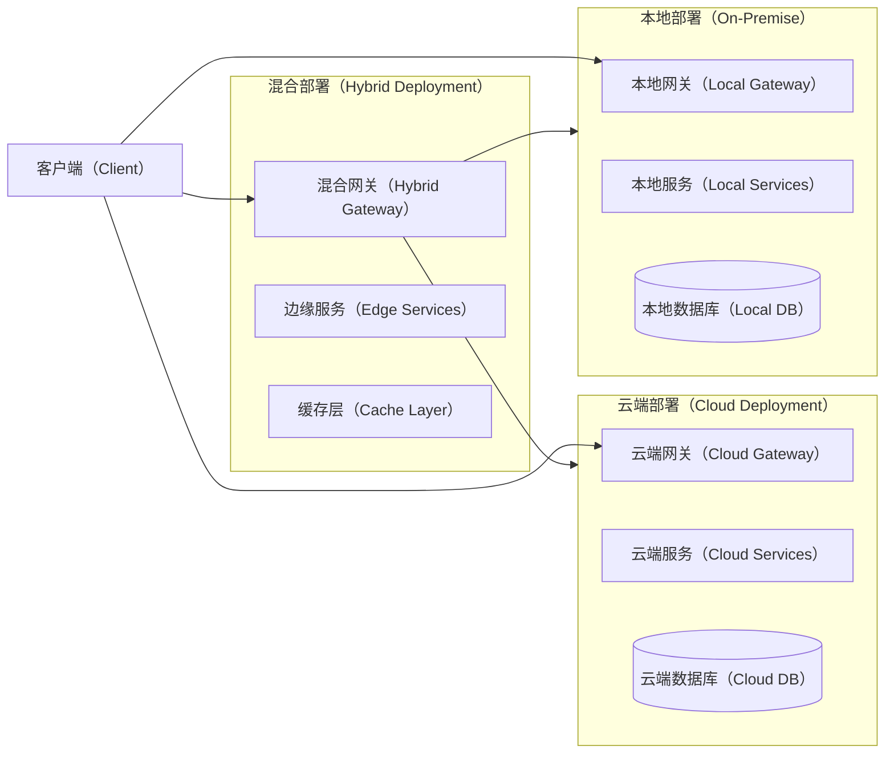

# ProtoForge 架构设计文档

## 1. 引言

ProtoForge是一个开源的AI智能体和自主AI框架，专为自主代码生成、产品原型设计、迭代开发和知识产权保护而设计。本文档详细阐述了ProtoForge的系统架构、设计原则、核心组件以及实现策略。

## 2. 领域问题全景分析

### 2.1 DFX问题全景

在现代软件开发生态中，开发团队面临着多重挑战：

**开发效率问题（Development Efficiency）**：
- 重复性代码编写占用大量开发时间
- 缺乏统一的代码生成标准和最佳实践
- 原型到生产的转换过程繁琐且容易出错

**多智能体协作问题（Multi-Agent Collaboration）**：
- 现有框架缺乏成熟的智能体编排机制
- 智能体间通信协议不统一
- 复杂业务场景下的智能体协调困难

**知识产权保护问题（IP Protection）**：
- 生成代码的许可证合规性难以追踪
- 缺乏有效的代码归属和版权标记机制
- 企业级代码保护需求得不到满足

**安全与隐私问题（Security & Privacy）**：
- 敏感代码数据需要云端处理的安全风险
- 缺乏企业级的访问控制和审计机制
- 多租户环境下的数据隔离挑战

### 2.2 解决方案全景

ProtoForge通过以下核心解决方案应对上述挑战：

**智能代码生成引擎**：
- 基于大语言模型的上下文感知代码生成
- 多语言支持和跨平台兼容性
- 智能代码优化和重构建议

**可组合智能体架构**：
- 模块化智能体设计，支持动态组合
- 事件驱动的异步通信机制
- 分层智能体管理和调度系统

**企业级IP保护体系**：
- 自动化许可证扫描和合规检查
- 代码水印和溯源技术
- 全生命周期的知识产权追踪

**零信任安全架构**：
- 私有化部署支持，数据不出内网
- 细粒度权限控制和多因素认证
- 全方位审计日志和行为分析

### 2.3 预期效果与展望

通过ProtoForge的实施，预期达成以下效果：

**短期效果（3-6个月）**：
- 代码生成效率提升60%以上
- 原型开发周期缩短50%
- 基础安全合规要求100%满足

**中期效果（6-12个月）**：
- 形成完整的AI驱动开发工作流
- 建立企业级知识产权保护标准
- 实现多项目、多团队的智能体协作

**长期愿景（1年以上）**：
- 成为行业标准的AI智能体开发框架
- 推动软件开发范式的根本性转变
- 构建开放的AI开发者生态系统

## 3. 系统架构设计

### 3.1 整体架构概览

ProtoForge采用分层微服务架构，确保系统的可扩展性、可维护性和安全性：

```mermaid
graph TB
    %% 架构分层图
    subgraph PL[展现层（Presentation Layer）]
        Web[Web界面（Web UI）]
        CLI[命令行工具（CLI Tool）]
        API[REST API接口（REST API）]
    end
    
    subgraph IL[集成层（Integration Layer）]
        Gateway[API网关（API Gateway）]
        Auth[认证服务（Auth Service）]
        Plugin[插件管理（Plugin Manager）]
    end
    
    subgraph AL[应用层（Application Layer）]
        WorkflowEngine[工作流引擎（Workflow Engine）]
        AgentOrchestrator[智能体编排器（Agent Orchestrator）]
        CodeGenerator[代码生成器（Code Generator）]
        IPProtector[IP保护器（IP Protector）]
    end
    
    subgraph DL[领域层（Domain Layer）]
        AgentManager[智能体管理（Agent Manager）]
        ProjectManager[项目管理（Project Manager）]
        SecurityManager[安全管理（Security Manager）]
        KnowledgeBase[知识库（Knowledge Base）]
    end
    
    subgraph IFL[基础设施层（Infrastructure Layer）]
        Database[(数据库（Database）)]
        MessageQueue[消息队列（Message Queue）]
        FileStorage[文件存储（File Storage）]
        Monitoring[监控系统（Monitoring）]
    end
    
    PL --> IL
    IL --> AL
    AL --> DL
    DL --> IFL
````

### 3.2 核心组件设计

#### 3.2.1 智能体编排系统

智能体编排系统是ProtoForge的核心，负责管理和协调多个AI智能体的协作：

```mermaid
sequenceDiagram
    participant User as 用户（User）
    participant Orchestrator as 编排器（Orchestrator）
    participant CodeAgent as 代码智能体（Code Agent）
    participant TestAgent as 测试智能体（Test Agent）
    participant ReviewAgent as 审查智能体（Review Agent）
    
    User->>Orchestrator: 1. 提交开发任务（Submit Task）
    Orchestrator->>CodeAgent: 2. 分配代码生成任务（Assign Code Generation）
    CodeAgent-->>Orchestrator: 3. 返回生成的代码（Return Generated Code）
    Orchestrator->>TestAgent: 4. 分配测试任务（Assign Testing）
    TestAgent-->>Orchestrator: 5. 返回测试结果（Return Test Results）
    Orchestrator->>ReviewAgent: 6. 分配代码审查任务（Assign Code Review）
    ReviewAgent-->>Orchestrator: 7. 返回审查意见（Return Review Comments）
    Orchestrator-->>User: 8. 返回完整结果（Return Complete Results）
```

#### 3.2.2 代码生成与优化流程

代码生成流程集成了多个智能体的协作，确保生成代码的质量和合规性：



### 3.3 部署架构

ProtoForge支持多种部署模式，满足不同企业的需求：



## 4. 项目目录结构

ProtoForge采用标准的Go项目结构，便于维护和扩展：

```
protoforge/
├── cmd/                          # 命令行工具和应用入口
│   ├── server/                   # 服务器启动程序
│   │   └── main.go
│   ├── cli/                      # 命令行工具
│   │   └── main.go
│   └── migrate/                  # 数据库迁移工具
│       └── main.go
├── internal/                     # 内部包，不对外暴露
│   ├── common/                   # 公共组件
│   │   ├── types/               # 类型定义
│   │   │   ├── enum/            # 枚举定义
│   │   │   │   └── enum.go
│   │   │   ├── models/          # 数据模型
│   │   │   │   ├── agent.go
│   │   │   │   ├── project.go
│   │   │   │   ├── workflow.go
│   │   │   │   ├── security.go
│   │   │   │   └── knowledge.go
│   │   │   └── dto/             # 数据传输对象
│   │   │       ├── request.go
│   │   │       ├── response.go
│   │   │       └── event.go
│   │   ├── errors/              # 错误定义
│   │   │   ├── codes.go
│   │   │   ├── errors.go
│   │   │   └── handler.go
│   │   ├── constants/           # 常量定义
│   │   │   ├── app.go
│   │   │   ├── message.go
│   │   │   └── config.go
│   │   ├── utils/               # 工具函数
│   │   │   ├── crypto.go
│   │   │   ├── file.go
│   │   │   ├── string.go
│   │   │   └── time.go
│   │   └── logger/              # 日志组件
│   │       ├── logger.go
│   │       ├── config.go
│   │       └── formatter.go
│   ├── core/                    # 核心业务逻辑
│   │   ├── interfaces/          # 接口定义
│   │   │   ├── agent.go
│   │   │   ├── workflow.go
│   │   │   ├── generator.go
│   │   │   ├── security.go
│   │   │   └── repository.go
│   │   ├── services/            # 核心服务
│   │   │   ├── agent/
│   │   │   │   ├── orchestrator.go
│   │   │   │   ├── manager.go
│   │   │   │   ├── communicator.go
│   │   │   │   └── lifecycle.go
│   │   │   ├── workflow/
│   │   │   │   ├── engine.go
│   │   │   │   ├── executor.go
│   │   │   │   ├── scheduler.go
│   │   │   │   └── monitor.go
│   │   │   ├── generator/
│   │   │   │   ├── code.go
│   │   │   │   ├── test.go
│   │   │   │   ├── documentation.go
│   │   │   │   └── optimizer.go
│   │   │   ├── security/
│   │   │   │   ├── auth.go
│   │   │   │   ├── rbac.go
│   │   │   │   ├── audit.go
│   │   │   │   └── encryption.go
│   │   │   └── knowledge/
│   │   │       ├── base.go
│   │   │       ├── indexer.go
│   │   │       ├── retriever.go
│   │   │       └── embedder.go
│   │   └── domain/              # 领域模型
│   │       ├── agent/
│   │       │   ├── entity.go
│   │       │   ├── valueobject.go
│   │       │   └── aggregate.go
│   │       ├── project/
│   │       │   ├── entity.go
│   │       │   ├── valueobject.go
│   │       │   └── aggregate.go
│   │       ├── workflow/
│   │       │   ├── entity.go
│   │       │   ├── valueobject.go
│   │       │   └── aggregate.go
│   │       └── security/
│   │           ├── entity.go
│   │           ├── valueobject.go
│   │           └── aggregate.go
│   ├── application/             # 应用层
│   │   ├── handlers/            # HTTP处理器
│   │   │   ├── agent.go
│   │   │   ├── project.go
│   │   │   ├── workflow.go
│   │   │   ├── security.go
│   │   │   └── health.go
│   │   ├── services/            # 应用服务
│   │   │   ├── agent_service.go
│   │   │   ├── project_service.go
│   │   │   ├── workflow_service.go
│   │   │   └── security_service.go
│   │   └── middleware/          # 中间件
│   │       ├── auth.go
│   │       ├── cors.go
│   │       ├── rate_limiter.go
│   │       ├── logger.go
│   │       └── recovery.go
│   ├── infrastructure/          # 基础设施层
│   │   ├── database/            # 数据库
│   │   │   ├── connection.go
│   │   │   ├── migrations/
│   │   │   │   ├── 001_initial.up.sql
│   │   │   │   ├── 001_initial.down.sql
│   │   │   │   ├── 002_agents.up.sql
│   │   │   │   └── 002_agents.down.sql
│   │   │   └── repositories/    # 数据仓库实现
│   │   │       ├── agent_repo.go
│   │   │       ├── project_repo.go
│   │   │       ├── workflow_repo.go
│   │   │       └── security_repo.go
│   │   ├── messaging/           # 消息队列
│   │   │   ├── publisher.go
│   │   │   ├── subscriber.go
│   │   │   ├── consumer.go
│   │   │   └── config.go
│   │   ├── storage/             # 文件存储
│   │   │   ├── local.go
│   │   │   ├── s3.go
│   │   │   ├── gcs.go
│   │   │   └── interface.go
│   │   ├── monitoring/          # 监控
│   │   │   ├── metrics.go
│   │   │   ├── tracing.go
│   │   │   ├── health.go
│   │   │   └── alerting.go
│   │   ├── cache/               # 缓存
│   │   │   ├── redis.go
│   │   │   ├── memory.go
│   │   │   └── interface.go
│   │   └── external/            # 外部服务集成
│   │       ├── llm/             # 大语言模型集成
│   │       │   ├── openai.go
│   │       │   ├── anthropic.go
│   │       │   ├── local.go
│   │       │   └── interface.go
│   │       ├── git/             # Git集成
│   │       │   ├── github.go
│   │       │   ├── gitlab.go
│   │       │   ├── local.go
│   │       │   └── interface.go
│   │       └── notification/    # 通知服务
│   │           ├── email.go
│   │           ├── slack.go
│   │           ├── webhook.go
│   │           └── interface.go
│   └── config/                  # 配置管理
│       ├── config.go
│       ├── database.go
│       ├── security.go
│       └── defaults.go
├── pkg/                         # 公共包，可被外部引用
│   ├── client/                  # 客户端SDK
│   │   ├── client.go
│   │   ├── agent.go
│   │   ├── project.go
│   │   └── workflow.go
│   ├── plugin/                  # 插件系统
│   │   ├── interface.go
│   │   ├── loader.go
│   │   ├── registry.go
│   │   └── manager.go
│   ├── sdk/                     # 开发工具包
│   │   ├── agent/
│   │   │   ├── builder.go
│   │   │   ├── runner.go
│   │   │   └── tester.go
│   │   ├── workflow/
│   │   │   ├── builder.go
│   │   │   ├── validator.go
│   │   │   └── exporter.go
│   │   └── generator/
│   │       ├── template.go
│   │       ├── parser.go
│   │       └── renderer.go
│   └── protocols/               # 协议定义
│       ├── mcp/                 # Model Context Protocol
│       │   ├── client.go
│       │   ├── server.go
│       │   └── types.go
│       ├── acp/                 # Agent Communication Protocol
│       │   ├── client.go
│       │   ├── server.go
│       │   └── types.go
│       └── a2a/                 # Agent-to-Agent Protocol
│           ├── client.go
│           ├── server.go
│           └── types.go
├── api/                         # API定义
│   ├── openapi/                 # OpenAPI规范
│   │   ├── v1/
│   │   │   ├── agent.yaml
│   │   │   ├── project.yaml
│   │   │   ├── workflow.yaml
│   │   │   └── security.yaml
│   │   └── swagger/
│   │       └── swagger.json
│   ├── proto/                   # Protocol Buffers定义
│   │   ├── agent/
│   │   │   └── agent.proto
│   │   ├── workflow/
│   │   │   └── workflow.proto
│   │   └── common/
│   │       └── common.proto
│   └── graphql/                 # GraphQL模式
│       ├── schema.graphql
│       ├── resolvers/
│       │   ├── agent.go
│       │   ├── project.go
│       │   └── workflow.go
│       └── generated/
│           └── generated.go
├── web/                         # Web前端
│   ├── ui/                      # 用户界面
│   │   ├── src/
│   │   │   ├── components/
│   │   │   ├── pages/
│   │   │   ├── services/
│   │   │   └── utils/
│   │   ├── public/
│   │   ├── package.json
│   │   └── webpack.config.js
│   └── static/                  # 静态资源
│       ├── css/
│       ├── js/
│       ├── images/
│       └── fonts/
├── configs/                     # 配置文件
│   ├── default.yaml
│   ├── development.yaml
│   ├── production.yaml
│   ├── testing.yaml
│   └── docker/
│       ├── docker-compose.yml
│       ├── docker-compose.dev.yml
│       └── Dockerfile
├── scripts/                     # 脚本文件
│   ├── build.sh
│   ├── deploy.sh
│   ├── test.sh
│   ├── migrate.sh
│   └── setup.sh
├── docs/                        # 文档
│   ├── architecture.md
│   ├── api.md
│   ├── deployment.md
│   ├── development.md
│   ├── plugins.md
│   └── examples/
│       ├── basic-usage.md
│       ├── advanced-workflows.md
│       └── plugin-development.md
├── examples/                    # 示例代码
│   ├── basic/
│   │   ├── hello-world/
│   │   ├── simple-agent/
│   │   └── basic-workflow/
│   ├── advanced/
│   │   ├── multi-agent/
│   │   ├── security-system/
│   │   └── full-stack-app/
│   └── plugins/
│       ├── custom-generator/
│       ├── external-integration/
│       └── monitoring-plugin/
├── test/                        # 测试文件
│   ├── integration/
│   │   ├── agent_test.go
│   │   ├── workflow_test.go
│   │   └── security_test.go
│   ├── e2e/
│   │   ├── scenarios/
│   │   └── fixtures/
│   └── benchmarks/
│       ├── performance/
│       └── load/
├── tools/                       # 开发工具
│   ├── generators/
│   │   ├── model.go
│   │   ├── api.go
│   │   └── test.go
│   ├── linters/
│   │   ├── custom-rules.go
│   │   └── config.yaml
│   └── migrate/
│       ├── migrator.go
│       └── templates/
├── deployments/                 # 部署配置
│   ├── kubernetes/
│   │   ├── namespace.yaml
│   │   ├── deployment.yaml
│   │   ├── service.yaml
│   │   ├── ingress.yaml
│   │   └── configmap.yaml
│   ├── docker/
│   │   ├── Dockerfile
│   │   ├── docker-compose.yml
│   │   └── .dockerignore
│   └── terraform/
│       ├── main.tf
│       ├── variables.tf
│       └── outputs.tf
├── .github/                     # GitHub配置
│   ├── workflows/
│   │   ├── ci.yml
│   │   ├── cd.yml
│   │   ├── security.yml
│   │   └── release.yml
│   ├── ISSUE_TEMPLATE/
│   └── PULL_REQUEST_TEMPLATE.md
├── go.mod                       # Go模块定义
├── go.sum                       # Go模块校验和
├── Makefile                     # 构建脚本
├── README.md                    # 项目说明
├── README-zh.md                 # 中文项目说明
├── LICENSE                      # 许可证
├── CONTRIBUTING.md              # 贡献指南
├── SECURITY.md                  # 安全政策
└── CHANGELOG.md                 # 变更日志
```

## 5\. 参考资料

[1] LangChain Documentation. https://python.langchain.com/docs/get\_started/introduction  
[2] Microsoft AutoGen. https://microsoft.github.io/autogen/  
[3] Eino Framework. https://github.com/cloudwego/eino  
[4] CrewAI Framework. https://github.com/joaomdmoura/crewAI  
[5] Standard Go Project Layout. https://github.com/golang-standards/project-layout